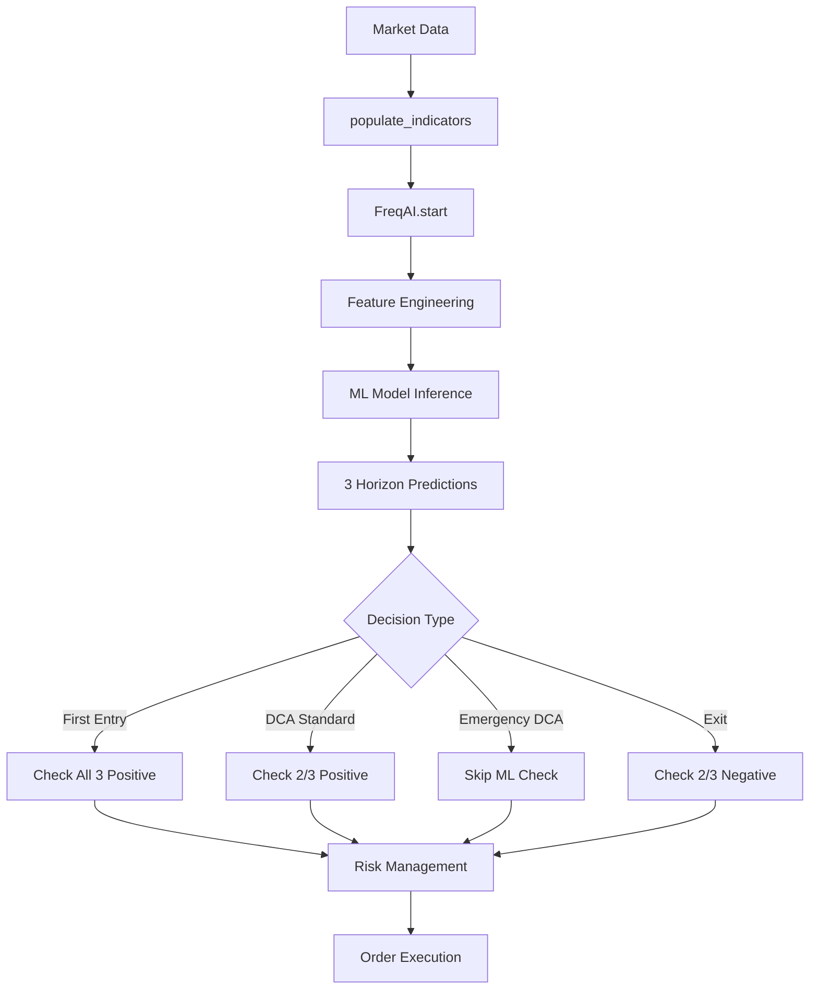

# Design Document: ML-Driven RyLoS Strategy Reengineering

## Overview

This design document describes the reengineering of RyLoSStrategyMLv3 to be 100% ML-driven with multi-horizon predictions. The current strategy uses traditional technical indicators (RSI, Bollinger Bands, Stochastic RSI, Williams %R) for entry/exit decisions with minimal ML filtering. The reengineered strategy will make all trading decisions based on machine learning predictions across three time horizons while maintaining the proven DCA risk management framework.

**Key Changes:**
- Replace all traditional indicator-based entry/exit logic with ML predictions
- Implement three prediction horizons: 15 minutes, 30 minutes, 1 hour
- Add 9 optimizable ML threshold parameters for hyperopt
- Remove temporal features (hour, day_of_week) to avoid time-based bias
- Add bb_percent feature for better market condition representation
- Maintain emergency DCA as a safety mechanism (no ML filtering)

## Architecture

### High-Level Flow

```
Market Data (5m candles)
    ↓
FreqAI Feature Engineering
    ↓
PyTorch Model Training (3 targets)
    ↓
ML Predictions (15m, 30m, 1h)
    ↓
Decision Logic (Entry/DCA/Exit)
    ↓
Risk Management (Limits, Cooldown)
    ↓
Order Execution
```

### Component Interaction



### Strategy Lifecycle

1. **Initialization**: Load parameters, initialize FreqAI
2. **Indicator Population**: Calculate technical indicators, call FreqAI.start()
3. **Feature Engineering**: Create ML features (base, expanded, standard)
4. **Target Definition**: Define 3 prediction targets (15m, 30m, 1h)
5. **Training** (offline): ML model trains on historical data
6. **Inference** (live): ML model predicts on current candle
7. **Decision Making**: Entry/DCA/Exit based on ML predictions
8. **Risk Management**: Apply limits, cooldown, stake sizing
9. **Order Execution**: Submit orders to exchange

## Components and Interfaces

### 1. Strategy Class (RyLoSStrategyMLv3)

**Responsibilities:**
- Coordinate all trading logic
- Manage ML predictions
- Implement entry/DCA/exit decisions
- Enforce risk management rules

**Key Methods:**

```python
class RyLoSStrategyMLv3(IStrategy):
    # Configuration
    timeframe = "5m"
    can_short = False
    leverage = 4.0
    position_adjustment_enable = True
    
    # ML Threshold Parameters (9 total)
    ml_entry_threshold_15m: DecimalParameter
    ml_entry_threshold_30m: DecimalParameter
    ml_entry_threshold_1h: DecimalParameter
    ml_dca_threshold_15m: DecimalParameter
    ml_dca_threshold_30m: DecimalParameter
    ml_dca_threshold_1h: DecimalParameter
    ml_exit_threshold_15m: DecimalParameter
    ml_exit_threshold_30m: DecimalParameter
    ml_exit_threshold_1h: DecimalParameter
    
    # DCA Parameters (maintained)
    first_order_pct: DecimalParameter
    dca_distance: DecimalParameter
    dca_multiplier: DecimalParameter
    dca_atr_multiplier: DecimalParameter
    dca_cooldown_candles: IntParameter
    emergency_dca_threshold: DecimalParameter
    emergency_critical_multiplier: DecimalParameter
    
    # Exit Parameters (maintained)
    min_profit_for_overbought_exit: DecimalParameter
    
    def populate_indicators(dataframe, metadata) -> DataFrame
    def get_ml_predictions(pair: str) -> tuple[float, float, float]
    def custom_stake_amount(...) -> float
    def adjust_trade_position(...) -> float | tuple[float, str] | None
    def custom_exit(...) -> str | None
```

### 2. FreqAI Integration

**Feature Engineering Methods:**

```python
def feature_engineering_expand_all(dataframe, period, metadata) -> DataFrame:
    """
    Features expanded for each period in indicator_periods_candles.
    Called for each period (e.g., 10).
    
    Returns:
        dataframe with columns:
        - %-rsi_{period}
        - %-bb_width_{period}
        - %-volume_ratio_{period}
    """

def feature_engineering_expand_basic(dataframe, metadata) -> DataFrame:
    """
    Base features calculated once - optimized for 5-minute scalping.
    
    Implementation details:
    
    # Existing features (maintained)
    dataframe["%-rsi"] = ta.RSI(dataframe["close"], timeperiod=10)
    dataframe["%-atr_pct"] = (ta.ATR(dataframe, timeperiod=10) / dataframe["close"]) * 100
    stoch_k, _ = ta.STOCHRSI(dataframe["close"], timeperiod=10, fastk_period=5, fastd_period=3)
    dataframe["%-stochrsi"] = stoch_k
    dataframe["%-williams"] = ta.WILLR(dataframe, timeperiod=10)
    dataframe["%-pct_change"] = dataframe["close"].pct_change()
    dataframe["%-pct_change_vol"] = dataframe["volume"].pct_change()
    
    # NEW: Bollinger Band %
    bb_upper, _, bb_lower = ta.BBANDS(dataframe["close"], timeperiod=20, nbdevup=2.0, nbdevdn=2.0)
    dataframe["%-bb_percent"] = (dataframe["close"] - bb_lower) / (bb_upper - bb_lower)
    
    # NEW: MACD (12,26,9) - Momentum confirmation
    macd, signal, hist = ta.MACD(dataframe["close"], fastperiod=12, slowperiod=26, signalperiod=9)
    dataframe["%-macd"] = macd
    dataframe["%-macd_signal"] = signal
    dataframe["%-macd_hist"] = hist
    
    # NEW: EMA 9 and 21 - Trend identification
    dataframe["%-ema_9"] = ta.EMA(dataframe["close"], timeperiod=9)
    dataframe["%-ema_21"] = ta.EMA(dataframe["close"], timeperiod=21)
    
    # NEW: CCI (10-period) - Extreme price movements for scalping
    dataframe["%-cci"] = ta.CCI(dataframe, timeperiod=10)
    
    # NEW: Supertrend (ATR 10, multiplier 3) - Clear trend direction
    # Note: Supertrend not in TA-Lib, use custom implementation or pandas_ta
    # For now, use simplified version: price relative to ATR bands
    atr = ta.ATR(dataframe, timeperiod=10)
    hl_avg = (dataframe["high"] + dataframe["low"]) / 2
    upper_band = hl_avg + (3 * atr)
    lower_band = hl_avg - (3 * atr)
    # Supertrend: 1 if uptrend (close > lower_band), -1 if downtrend
    dataframe["%-supertrend"] = (dataframe["close"] > lower_band).astype(int) - (dataframe["close"] < upper_band).astype(int)
    
    # NEW: VWAP - Volume Weighted Average Price
    # VWAP = cumsum(typical_price * volume) / cumsum(volume)
    typical_price = (dataframe["high"] + dataframe["low"] + dataframe["close"]) / 3
    dataframe["%-vwap"] = (typical_price * dataframe["volume"]).cumsum() / dataframe["volume"].cumsum()
    
    # NEW: OBV normalized - On-Balance Volume
    obv = ta.OBV(dataframe["close"], dataframe["volume"])
    dataframe["%-obv_norm"] = obv / obv.rolling(window=20).mean()
    
    Returns:
        dataframe with 16 base features for ML model
    """

def feature_engineering_standard(dataframe, metadata) -> DataFrame:
    """
    Standard features (not expanded).
    
    Returns:
        dataframe with columns:
        - %-adx (14 period - trend strength filter)
        
    REMOVED:
        - %-hour (temporal bias)
        - %-day_of_week (temporal bias)
    """

def set_freqai_targets(dataframe, metadata) -> DataFrame:
    """
    Define 3 prediction targets.
    
    Returns:
        dataframe with columns:
        - &-s_close_15m: (close[+3] - close) / close
        - &-s_close_30m: (close[+6] - close) / close
        - &-s_close_1h: (close[+12] - close) / close
    """
```

**Feature Summary:**

Total Features: 22 (removed 2 temporal, added 10 scalping indicators)

- **Base (16)**: rsi, atr_pct, stochrsi, williams, pct_change, pct_change_vol, bb_percent, macd, macd_signal, macd_hist, ema_9, ema_21, cci, supertrend, vwap, obv_norm
- **Expanded (3)**: rsi_10, bb_width_10, volume_ratio_10
- **Standard (1)**: adx
- **Removed (2)**: hour, day_of_week

**Scalping-Optimized Indicators:**

1. **MACD (12,26,9)**: Momentum confirmation, crossover signals
2. **EMA 9/21**: Short and medium-term trend identification
3. **CCI (10-period)**: Extreme price movements, faster than default 14
4. **Supertrend (ATR 10,3)**: Clear trend direction with volatility adjustment
5. **VWAP**: Institutional-grade support/resistance levels
6. **OBV (normalized)**: Volume confirmation for price movements

These indicators provide the ML model with:
- **Trend signals**: EMA 9/21, Supertrend
- **Momentum signals**: MACD, CCI, RSI, Stochastic
- **Volume confirmation**: OBV, VWAP
- **Volatility adaptation**: ATR, Supertrend, Bollinger Bands
- **Strength filtering**: ADX

### 3. ML Prediction Retrieval

**Interface:**

```python
def get_ml_predictions(self, pair: str) -> tuple[float, float, float]:
    """
    Retrieve all three horizon predictions for a pair.
    
    Args:
        pair: Trading pair (e.g., "BTC/USDT")
    
    Returns:
        tuple: (pred_15m, pred_30m, pred_1h)
               Returns (0.0, 0.0, 0.0) if predictions unavailable
    
    Example:
        pred_15m, pred_30m, pred_1h = self.get_ml_predictions(trade.pair)
        if pred_15m > 0.005 and pred_30m > 0.005 and pred_1h > 0.005:
            # All horizons positive - good entry signal
    """
```

**Implementation:**

```python
def get_ml_predictions(self, pair: str) -> tuple[float, float, float]:
    dataframe, _ = self.dp.get_analyzed_dataframe(pair, self.timeframe)
    
    if len(dataframe) < 1:
        return (0.0, 0.0, 0.0)
    
    current_candle = dataframe.iloc[-1]
    
    pred_15m = current_candle.get("&-s_close_15m", 0.0)
    pred_30m = current_candle.get("&-s_close_30m", 0.0)
    pred_1h = current_candle.get("&-s_close_1h", 0.0)
    
    return (pred_15m, pred_30m, pred_1h)
```

### 4. Decision Logic Components

#### Entry Decision

**Logic:** All 3 horizons must be positive (above thresholds)

```python
# In populate_indicators or custom logic
pred_15m, pred_30m, pred_1h = self.get_ml_predictions(pair)

entry_signal = (
    pred_15m > self.ml_entry_threshold_15m.value and
    pred_30m > self.ml_entry_threshold_30m.value and
    pred_1h > self.ml_entry_threshold_1h.value
)

if entry_signal:
    dataframe.loc[index, 'enter_long'] = 1
    dataframe.loc[index, 'enter_tag'] = (
        f"buy_ml_all_positive_"
        f"15m:{pred_15m:.4f}_"
        f"30m:{pred_30m:.4f}_"
        f"1h:{pred_1h:.4f}"
    )
```

#### DCA Decision

**Logic:** At least 2 out of 3 horizons must be positive

```python
# In adjust_trade_position
pred_15m, pred_30m, pred_1h = self.get_ml_predictions(trade.pair)

positive_count = sum([
    pred_15m > self.ml_dca_threshold_15m.value,
    pred_30m > self.ml_dca_threshold_30m.value,
    pred_1h > self.ml_dca_threshold_1h.value
])

if positive_count >= 2:
    # Allow DCA
    horizons_positive = []
    if pred_15m > self.ml_dca_threshold_15m.value:
        horizons_positive.append("15m")
    if pred_30m > self.ml_dca_threshold_30m.value:
        horizons_positive.append("30m")
    if pred_1h > self.ml_dca_threshold_1h.value:
        horizons_positive.append("1h")
    
    tag = f"dca_ml_2of3_{'+'.join(horizons_positive)}"
    return next_stake, tag
else:
    # Block DCA
    logger.info(
        f"{trade.pair}: DCA blocked by ML filter "
        f"(15m={pred_15m:.4f}, 30m={pred_30m:.4f}, 1h={pred_1h:.4f})"
    )
    return None
```

#### Emergency DCA Decision

**Logic:** No ML filtering - always execute if threshold breached

```python
# In adjust_trade_position
current_loss_from_last = (current_rate - last_order_price) / last_order_price

if current_loss_from_last <= self.emergency_dca_threshold.value:
    # Emergency DCA - SKIP ML checks
    critical_threshold = (
        self.emergency_dca_threshold.value * 
        self.emergency_critical_multiplier.value
    )
    
    if current_loss_from_last <= critical_threshold:
        # Calculate emergency stake
        # Apply risk management limits
        # Return stake and tag
        return emergency_stake, f"emergency_dca_{loss_pct:.1f}%"
```

#### Exit Decision

**Logic:** At least 2 out of 3 horizons must be negative (below thresholds)

```python
# In custom_exit
if current_profit > self.min_profit_for_overbought_exit.value:
    pred_15m, pred_30m, pred_1h = self.get_ml_predictions(trade.pair)
    
    negative_count = sum([
        pred_15m < self.ml_exit_threshold_15m.value,
        pred_30m < self.ml_exit_threshold_30m.value,
        pred_1h < self.ml_exit_threshold_1h.value
    ])
    
    if negative_count >= 2:
        horizons_negative = []
        if pred_15m < self.ml_exit_threshold_15m.value:
            horizons_negative.append("15m")
        if pred_30m < self.ml_exit_threshold_30m.value:
            horizons_negative.append("30m")
        if pred_1h < self.ml_exit_threshold_1h.value:
            horizons_negative.append("1h")
        
        logger.info(
            f"{trade.pair}: Exit triggered by ML "
            f"(15m={pred_15m:.4f}, 30m={pred_30m:.4f}, 1h={pred_1h:.4f})"
        )
        
        return f"sell_ml_2of3_negative_{'+'.join(horizons_negative)}"
```

### 5. Risk Management Components

**Maintained from existing implementation:**

- `custom_stake_amount()`: First order sizing based on balance percentage (with optional ML confidence multiplier)
- `calculate_max_orders()`: Dynamic max orders based on leverage and limits
- `get_dynamic_dca_distance()`: ATR-based DCA spacing
- `get_total_position_value()`: Global exposure tracking
- Per-pair limits: `(balance × leverage) / max_open_trades`
- Global limits: `balance × leverage` (CRITICAL: sum of all positions across all pairs)
- DCA cooldown: Wait N candles after last filled order
- Order checks: Skip if `trade.has_open_orders`

**CRITICAL Risk Management Rules:**

1. **Global Limit**: Total exposure across ALL pairs MUST NOT exceed `balance × 4`
   - Calculated as: sum of (stake × leverage) for all open positions
   - Checked before EVERY order (first entry, DCA, emergency DCA)
   - **For single-pair trading (max_open_trades=1)**: The single pair can use the full `balance × 4`
   
2. **Per-Pair Limit**: Each pair's total exposure MUST NOT exceed `(balance × 4) / max_open_trades`
   - Example with multi-pair: balance=10000, max_open_trades=10 → per-pair limit = 4000$
   - Example with single-pair: balance=10000, max_open_trades=1 → per-pair limit = 40000$
   - Includes first order + all DCA orders for that pair
   
3. **Dynamic Order Count**: `calculate_max_orders()` determines how many DCA orders fit within per-pair limit
   - Accounts for progressive stake sizing (dca_multiplier)
   - Prevents exceeding per-pair limit even with maximum DCA
   - **For single-pair trading**: More DCA orders possible since full balance × 4 is available
   
4. **Stake Reduction**: If calculated stake would breach limits, reduce it to fit
   - If reduced stake < min_stake, skip the order
   - Applies to all order types (first, DCA, emergency DCA)

**Example Calculation (Single-Pair Trading):**
```python
balance = 10000
leverage = 4
max_open_trades = 1  # Single pair

global_limit = 10000 * 4 = 40000$  # Total available
per_pair_limit = 40000 / 1 = 40000$  # Same as global (single pair)

# First order
first_order_pct = 0.029  # 2.9%
first_stake = 10000 * 0.029 = 290$
first_position_value = 290 * 4 = 1160$

# DCA orders (with multiplier 1.991)
dca_1_stake = 290 * 1.991 = 577.39$
dca_1_position_value = 577.39 * 4 = 2309.56$

dca_2_stake = 577.39 * 1.991 = 1149.58$
dca_2_position_value = 1149.58 * 4 = 4598.32$

dca_3_stake = 1149.58 * 1.991 = 2288.85$
dca_3_position_value = 2288.85 * 4 = 9155.40$

# ... continues until cumulative position value approaches 40000$

# With these parameters, approximately 6-7 DCA orders fit within 40000$ limit
# Total position: first + dca_1 + dca_2 + ... + dca_6 ≈ 38000-40000$
```

**Key Insight for Single-Pair Trading:**
- With max_open_trades=1, you can have many more DCA orders
- The strategy will use almost the entire balance through progressive DCA
- Emergency DCA can still trigger even near the limit (with stake reduction if needed)

**Freqtrade Configuration Note:**

In Freqtrade, there are TWO ways to limit DCA orders:

1. **Strategy-level**: `max_entry_position_adjustment` attribute (REMOVED in current implementation)
   ```python
   # OLD approach (not used):
   max_entry_position_adjustment = 5  # Max 5 DCA orders
   ```

2. **Dynamic calculation** (CURRENT approach - MAINTAINED):
   ```python
   def calculate_max_orders(self, total_balance: float) -> int:
       """Calculate max orders based on balance and limits"""
       # Returns dynamic number based on:
       # - first_order_pct
       # - dca_multiplier
       # - per_pair_limit
   ```

**Why Dynamic is Better:**
- Adapts to different balance sizes
- Respects risk limits automatically
- Works with optimized parameters from hyperopt
- No hardcoded limit that might be too restrictive or too permissive

**Implementation Note:**
The reengineered strategy will MAINTAIN the dynamic `calculate_max_orders()` approach and will NOT use `max_entry_position_adjustment`. This ensures DCA orders automatically fit within the `balance × 4` limit regardless of parameter values.

**NEW: ML Confidence-Based Stake Sizing (Optional)**

```python
def custom_stake_amount(
    self,
    pair: str,
    current_time,
    current_rate: float,
    proposed_stake: float,
    min_stake,
    max_stake: float,
    leverage: float,
    entry_tag,
    side: str,
    **kwargs,
) -> float:
    total_balance = self.wallets.get_total_stake_amount()
    max_open_trades = self.config.get("max_open_trades", 1)
    
    # Limite globale e per pair
    global_limit = total_balance * 4
    per_pair_limit = global_limit / max_open_trades
    
    # Base stake (percentuale del balance)
    base_stake = total_balance * self.first_order_pct.value
    
    # OPTIONAL: ML Confidence Multiplier
    if self.ml_stake_confidence_enabled.value:
        pred_15m, pred_30m, pred_1h = self.get_ml_predictions(pair)
        avg_prediction = (pred_15m + pred_30m + pred_1h) / 3
        
        # Map prediction to confidence multiplier (0.5 to 1.5)
        # Higher positive predictions = higher multiplier
        # Example: pred=0.02 (2%) -> multiplier=1.5
        #          pred=0.005 (0.5%) -> multiplier=1.0
        #          pred=0.0 -> multiplier=0.75
        #          pred=-0.01 -> multiplier=0.5
        confidence_multiplier = np.clip(
            0.5 + (avg_prediction - self.ml_confidence_min.value) / 
            (self.ml_confidence_max.value - self.ml_confidence_min.value),
            0.5, 1.5
        )
        
        base_stake = base_stake * confidence_multiplier
        
        logger.info(
            f"{pair}: ML confidence multiplier {confidence_multiplier:.2f} "
            f"(avg_pred={avg_prediction:.4f})"
        )
    
    # Esposizione attuale globale
    current_global_exposure = self.get_total_position_value()
    remaining_global = global_limit - current_global_exposure
    
    # Limita al rimanente globale e al limite per pair
    max_allowed_stake = min(remaining_global / 4, per_pair_limit / 4)
    
    return min(base_stake, max_allowed_stake, max_stake)
```

**Parameters**:
```python
# Optional ML confidence-based stake sizing
ml_stake_confidence_enabled = BoolParameter(default=False, space="buy", optimize=False)
ml_confidence_min = DecimalParameter(-0.02, 0.0, default=-0.01, space="buy", optimize=True)
ml_confidence_max = DecimalParameter(0.01, 0.05, default=0.02, space="buy", optimize=True)
```

**Rationale**:
- High confidence entries (all 3 horizons strongly positive) get larger stake
- Low confidence entries (barely passing thresholds) get smaller stake
- Risk limits still enforced - total position never exceeds per-pair or global limits
- Disabled by default for backward compatibility
- Can be enabled and optimized via hyperopt

## Data Models

### ML Prediction Data

```python
@dataclass
class MLPredictions:
    """Container for multi-horizon ML predictions"""
    pred_15m: float  # 15-minute horizon prediction
    pred_30m: float  # 30-minute horizon prediction
    pred_1h: float   # 1-hour horizon prediction
    
    def count_positive(self, thresholds: tuple[float, float, float]) -> int:
        """Count how many predictions exceed their thresholds"""
        count = 0
        if self.pred_15m > thresholds[0]:
            count += 1
        if self.pred_30m > thresholds[1]:
            count += 1
        if self.pred_1h > thresholds[2]:
            count += 1
        return count
    
    def count_negative(self, thresholds: tuple[float, float, float]) -> int:
        """Count how many predictions are below their thresholds"""
        count = 0
        if self.pred_15m < thresholds[0]:
            count += 1
        if self.pred_30m < thresholds[1]:
            count += 1
        if self.pred_1h < thresholds[2]:
            count += 1
        return count
```

### Parameter Configuration

```python
# Entry Thresholds (all 3 must be positive)
ml_entry_threshold_15m = DecimalParameter(
    -0.01, 0.02, default=0.005, space="buy", optimize=True
)
ml_entry_threshold_30m = DecimalParameter(
    -0.01, 0.02, default=0.005, space="buy", optimize=True
)
ml_entry_threshold_1h = DecimalParameter(
    -0.01, 0.02, default=0.005, space="buy", optimize=True
)

# DCA Thresholds (2 out of 3 must be positive)
ml_dca_threshold_15m = DecimalParameter(
    -0.05, 0.01, default=-0.01, space="buy", optimize=True
)
ml_dca_threshold_30m = DecimalParameter(
    -0.05, 0.01, default=-0.01, space="buy", optimize=True
)
ml_dca_threshold_1h = DecimalParameter(
    -0.05, 0.01, default=-0.01, space="buy", optimize=True
)

# Exit Thresholds (2 out of 3 must be negative)
ml_exit_threshold_15m = DecimalParameter(
    -0.02, 0.01, default=-0.005, space="sell", optimize=True
)
ml_exit_threshold_30m = DecimalParameter(
    -0.02, 0.01, default=-0.005, space="sell", optimize=True
)
ml_exit_threshold_1h = DecimalParameter(
    -0.02, 0.01, default=-0.005, space="sell", optimize=True
)
```

### Feature Data Model

```python
# Features passed to ML model (22 total)
features = {
    # Base features (16)
    "%-rsi": float,              # RSI(10) - responsive for scalping
    "%-atr_pct": float,          # ATR as % of price
    "%-stochrsi": float,         # Stochastic RSI K line
    "%-williams": float,         # Williams %R
    "%-pct_change": float,       # Close price % change
    "%-pct_change_vol": float,   # Volume % change
    "%-bb_percent": float,       # NEW: Bollinger Band %
    "%-macd": float,             # NEW: MACD line (12,26,9)
    "%-macd_signal": float,      # NEW: MACD signal line
    "%-macd_hist": float,        # NEW: MACD histogram
    "%-ema_9": float,            # NEW: 9-period EMA (short-term trend)
    "%-ema_21": float,           # NEW: 21-period EMA (medium-term trend)
    "%-cci": float,              # NEW: CCI(10) for scalping
    "%-supertrend": float,       # NEW: Supertrend ATR(10,3)
    "%-vwap": float,             # NEW: Volume Weighted Average Price
    "%-obv_norm": float,         # NEW: On-Balance Volume normalized
    
    # Expanded features (3)
    "%-rsi_10": float,           # RSI for period 10
    "%-bb_width_10": float,      # BB width for period 10
    "%-volume_ratio_10": float,  # Volume ratio for period 10
    
    # Standard features (1)
    "%-adx": float,              # ADX(14) - trend strength
    
    # Removed features (2)
    # "%-hour": REMOVED (temporal bias)
    # "%-day_of_week": REMOVED (temporal bias)
}

# Targets for ML model (3)
targets = {
    "&-s_close_15m": float,  # Price change % at +3 candles
    "&-s_close_30m": float,  # Price change % at +6 candles
    "&-s_close_1h": float,   # Price change % at +12 candles
}
```

## Correctness Properties

*A property is a characteristic or behavior that should hold true across all valid executions of a system—essentially, a formal statement about what the system should do. Properties serve as the bridge between human-readable specifications and machine-verifiable correctness guarantees.*


### Property 1: Multi-Horizon Target Calculation Correctness

*For any* dataframe with price data, when set_freqai_targets() calculates the three target columns, each target should equal the percentage price change from current close to the close price at the specified horizon (3 candles for 15m, 6 candles for 30m, 12 candles for 1h), calculated as (future_close - current_close) / current_close

**Validates: Requirements 1.2, 1.3, 1.4**

### Property 2: ML Prediction Retrieval Completeness

*For any* trading pair, when get_ml_predictions() is called, it should return a tuple of exactly three float values corresponding to the 15m, 30m, and 1h predictions from the most recent candle, or (0.0, 0.0, 0.0) if predictions are unavailable

**Validates: Requirements 1.5, 8.2, 8.4, 8.5**

### Property 3: Entry Requires All Horizons Positive

*For any* set of ML predictions and entry thresholds, an entry signal should be generated if and only if all three predictions (15m, 30m, 1h) exceed their respective entry thresholds

**Validates: Requirements 2.1, 2.2**

### Property 4: Entry Tag Contains All Predictions

*For any* ML-triggered entry, the entry tag should contain the string "buy_ml_all_positive" and include all three prediction values formatted to 4 decimal places

**Validates: Requirements 2.6**

### Property 5: DCA Requires 2-of-3 Horizons Positive

*For any* set of ML predictions and DCA thresholds, a standard DCA should be allowed if and only if at least 2 out of 3 predictions exceed their respective DCA thresholds

**Validates: Requirements 3.1, 3.2**

### Property 6: DCA Tag Identifies Positive Horizons

*For any* ML-filtered DCA execution, the tag should contain "dca_ml_2of3" and identify which specific horizons (15m, 30m, 1h) passed their thresholds

**Validates: Requirements 3.6**

### Property 7: Emergency DCA Bypasses ML Filtering

*For any* position with unrealized loss exceeding the emergency threshold, emergency DCA should execute regardless of ML prediction values, and should never be blocked by ML filters

**Validates: Requirements 4.1, 4.4**

### Property 8: Emergency DCA Tag Identification

*For any* emergency DCA execution, the tag should contain either "emergency_dca" or "dca_critical" to distinguish it from standard DCA orders

**Validates: Requirements 4.5**

### Property 9: Exit Requires 2-of-3 Horizons Negative

*For any* set of ML predictions and exit thresholds, when current profit exceeds the minimum profit requirement, an exit signal should be generated if and only if at least 2 out of 3 predictions are below their respective exit thresholds

**Validates: Requirements 5.1, 5.2, 5.8**

### Property 10: Exit Tag Identifies Negative Horizons

*For any* ML-triggered exit, the tag should contain "sell_ml_2of3_negative" and identify which specific horizons were below their thresholds

**Validates: Requirements 5.6**

### Property 11: BB Percent and New Scalping Features Calculation

*For any* candle with valid OHLC data, the strategy should calculate all new features correctly:
- %-bb_percent = (close - bb_lower) / (bb_upper - bb_lower) using 20-period Bollinger Bands
- %-macd, %-macd_signal, %-macd_hist using 12,26,9 configuration
- %-ema_9 and %-ema_21 using respective periods
- %-cci using 10-period for scalping responsiveness
- %-supertrend using ATR(10) with multiplier 3
- %-vwap as cumulative volume-weighted average
- %-obv_norm as OBV divided by 20-period rolling mean

**Validates: Requirements 6.3, 6.4, 6.5, 6.6, 6.7, 6.8, 6.9, 6.10, 6.11, 6.12, 6.13**

### Property 12: FreqAI Start Called Before Indicators

*For any* call to populate_indicators(), self.freqai.start() must be invoked before any technical indicator calculations, ensuring FreqAI processes the dataframe first

**Validates: Requirements 9.3**

### Property 13: Risk Management Preservation

*For any* trading decision (entry, DCA, exit), the strategy should enforce all existing risk management rules: per-pair position limits based on max_open_trades, global position limits based on balance × leverage, DCA cooldown based on dca_cooldown_candles, and the has_open_orders check before position adjustments

**Validates: Requirements 10.5, 10.6, 10.7, 10.8, 3.7, 3.8**

### Property 14: DCA Distance and Stake Progression

*For any* DCA opportunity, the distance calculation should use get_dynamic_dca_distance() with ATR-based volatility adjustment, and stake sizing should follow the progression formula: first_order_pct × (dca_multiplier ^ entry_count)

**Validates: Requirements 3.7, 10.3**

### Property 15: ML Decision Logging Completeness

*For any* ML-based trading decision (entry, DCA block, DCA allow, exit), the strategy should log a message containing the pair name, all three prediction values formatted to 4 decimal places, the relevant thresholds, and which horizons passed or failed their checks

**Validates: Requirements 11.1, 11.2, 11.3, 11.4, 11.6, 11.7**

### Property 16: Multi-Target Model Support

*For any* training data with multiple target columns, the ML_Model should detect the number of targets, set output_dim accordingly, train on all targets simultaneously, return predictions for all targets during inference, and create separate dataframe columns for each target prediction

**Validates: Requirements 13.1, 13.2, 13.3, 13.4, 13.5**

### Property 17: Model Backward Compatibility

*For any* configuration (single-target or multi-target), the ML_Model should function correctly, maintaining backward compatibility with existing single-target setups while supporting the new multi-target functionality

**Validates: Requirements 13.6, 9.2**

### Property 18: ML Confidence-Based Stake Sizing (Optional)

*For any* entry signal, when ml_stake_confidence_enabled is True, the first order stake should equal base_stake × confidence_multiplier, where confidence_multiplier is calculated from the average of the three horizon predictions and clamped between 0.5 and 1.5, and the final stake must respect per-pair and global position limits

**Validates: Requirements 14.2, 14.3, 14.4, 14.6, 14.7**

## Error Handling

### ML Prediction Unavailability

**Scenario**: ML predictions are not available (empty dataframe, missing columns, FreqAI not initialized)

**Handling**:
- `get_ml_predictions()` returns (0.0, 0.0, 0.0)
- Entry logic: All thresholds compared against 0.0 will fail (assuming positive thresholds), preventing entries
- DCA logic: 2-of-3 check against 0.0 will likely fail, blocking DCA
- Exit logic: 2-of-3 check against 0.0 may pass if exit thresholds are negative, allowing exits
- Emergency DCA: Unaffected, executes normally

**Rationale**: Conservative approach - when ML is unavailable, avoid new positions but allow exits

### Invalid Prediction Values

**Scenario**: ML model returns NaN, inf, or extremely large values

**Handling**:
- Use `.get()` with default 0.0 when retrieving predictions from dataframe
- Pandas will handle NaN comparisons (NaN < threshold = False, NaN > threshold = False)
- Log warning if predictions are outside expected range (-1.0 to 1.0)

### FreqAI Training Failures

**Scenario**: ML model fails to train on a pair

**Handling**:
- FreqAI will skip that pair and log error
- Strategy will receive no predictions for that pair
- Falls back to prediction unavailability handling (returns 0.0, 0.0, 0.0)
- Emergency DCA still functions as safety net

### Threshold Misconfiguration

**Scenario**: Hyperopt sets thresholds that make trading impossible (e.g., all entry thresholds > 0.1)

**Handling**:
- No explicit validation - hyperopt will naturally select against poor thresholds
- Backtest results will show zero trades
- Hyperopt loss function will penalize configurations with insufficient trades

### Emergency DCA Limit Breaches

**Scenario**: Emergency DCA would exceed per-pair or global limits

**Handling**:
- Reduce stake to fit within limits (existing logic preserved)
- If reduced stake < min_stake, skip the emergency DCA
- Log warning about stake reduction
- This is existing behavior, maintained in reengineering

### Dataframe Index Errors

**Scenario**: Attempting to access iloc[-1] on empty dataframe

**Handling**:
```python
if len(dataframe) < 1:
    return (0.0, 0.0, 0.0)
```
- Check dataframe length before accessing
- Return safe default values

### Column Missing Errors

**Scenario**: Target columns not present in dataframe

**Handling**:
```python
pred_15m = current_candle.get("&-s_close_15m", 0.0)
```
- Use `.get()` with default value instead of direct access
- Prevents KeyError exceptions
- Returns 0.0 for missing predictions

## Testing Strategy

### Dual Testing Approach

The testing strategy combines unit tests for specific scenarios and property-based tests for universal correctness guarantees.

**Unit Tests** focus on:
- Specific examples of ML decision logic
- Edge cases (empty dataframes, missing columns, zero predictions)
- Integration points (FreqAI method calls, dataframe structure)
- Configuration validation (parameter ranges, defaults)

**Property-Based Tests** focus on:
- Universal properties across all inputs (target calculations, voting logic)
- Randomized prediction values and thresholds
- Risk management enforcement across scenarios
- Logging completeness for all decision types

### Property-Based Testing Configuration

**Library**: Use `hypothesis` for Python property-based testing

**Configuration**:
- Minimum 100 iterations per property test
- Each test tagged with: `# Feature: ml-strategy-reengineering, Property N: [property text]`
- Use `@given` decorators with appropriate strategies

**Example Property Test Structure**:

```python
from hypothesis import given, strategies as st
import pytest

# Feature: ml-strategy-reengineering, Property 3: Entry Requires All Horizons Positive
@given(
    pred_15m=st.floats(min_value=-0.1, max_value=0.1),
    pred_30m=st.floats(min_value=-0.1, max_value=0.1),
    pred_1h=st.floats(min_value=-0.1, max_value=0.1),
    threshold_15m=st.floats(min_value=-0.01, max_value=0.02),
    threshold_30m=st.floats(min_value=-0.01, max_value=0.02),
    threshold_1h=st.floats(min_value=-0.01, max_value=0.02),
)
@pytest.mark.parametrize("min_examples", [100])
def test_entry_requires_all_horizons_positive(
    pred_15m, pred_30m, pred_1h,
    threshold_15m, threshold_30m, threshold_1h
):
    """
    Property: Entry signal should be generated if and only if
    all three predictions exceed their respective thresholds.
    """
    # Setup strategy with thresholds
    strategy = RyLoSStrategyMLv3()
    strategy.ml_entry_threshold_15m.value = threshold_15m
    strategy.ml_entry_threshold_30m.value = threshold_30m
    strategy.ml_entry_threshold_1h.value = threshold_1h
    
    # Mock predictions
    mock_dataframe = create_mock_dataframe_with_predictions(
        pred_15m, pred_30m, pred_1h
    )
    
    # Check entry logic
    all_positive = (
        pred_15m > threshold_15m and
        pred_30m > threshold_30m and
        pred_1h > threshold_1h
    )
    
    entry_signal = strategy.check_entry_signal(mock_dataframe)
    
    assert entry_signal == all_positive
```

### Unit Test Examples

**Test: Target Column Creation**
```python
def test_set_freqai_targets_creates_three_columns():
    """Validates: Requirements 1.1, 1.6"""
    strategy = RyLoSStrategyMLv3()
    dataframe = create_sample_dataframe(100)
    
    result = strategy.set_freqai_targets(dataframe, {})
    
    assert "&-s_close_15m" in result.columns
    assert "&-s_close_30m" in result.columns
    assert "&-s_close_1h" in result.columns
```

**Test: Emergency DCA Bypasses ML**
```python
def test_emergency_dca_ignores_negative_ml_predictions():
    """Validates: Requirements 4.1, 4.4"""
    strategy = RyLoSStrategyMLv3()
    trade = create_mock_trade_with_loss(-0.13)  # -13% loss
    
    # Mock all ML predictions as negative
    mock_predictions(-0.05, -0.05, -0.05)
    
    # Emergency DCA should still execute
    result = strategy.adjust_trade_position(trade, ...)
    
    assert result is not None
    assert "emergency_dca" in result[1]
```

**Test: Feature Removal**
```python
def test_temporal_features_removed():
    """Validates: Requirements 6.1, 6.2"""
    strategy = RyLoSStrategyMLv3()
    dataframe = create_sample_dataframe(100)
    
    result = strategy.feature_engineering_standard(dataframe, {})
    
    assert "%-hour" not in result.columns
    assert "%-day_of_week" not in result.columns
```

**Test: BB Percent Feature Added**
```python
def test_bb_percent_feature_added():
    """Validates: Requirements 6.3"""
    strategy = RyLoSStrategyMLv3()
    dataframe = create_sample_dataframe(100)
    
    result = strategy.feature_engineering_expand_basic(dataframe, {})
    
    assert "%-bb_percent" in result.columns
```

### Integration Tests

**Test: Full Entry Flow**
- Create dataframe with price data
- Call populate_indicators (includes FreqAI.start())
- Verify ML predictions are populated
- Check entry signal generation
- Verify entry tag format

**Test: Full DCA Flow**
- Create trade with existing position
- Mock ML predictions (various combinations)
- Call adjust_trade_position
- Verify 2-of-3 logic
- Check DCA execution or blocking

**Test: Full Exit Flow**
- Create profitable trade
- Mock ML predictions (various combinations)
- Call custom_exit
- Verify 2-of-3 logic
- Check exit signal and tag

### Test Coverage Goals

- **Unit Tests**: 80%+ code coverage
- **Property Tests**: All 17 correctness properties
- **Integration Tests**: All major flows (entry, DCA, emergency DCA, exit)
- **Edge Cases**: Empty dataframes, missing columns, extreme values
- **Backward Compatibility**: Existing risk management, DCA logic, stake sizing

### Testing Commands

```bash
# Run all tests
pytest tests/strategy/test_rylos_ml_v3.py -v

# Run property tests only
pytest tests/strategy/test_rylos_ml_v3.py -v -m property

# Run with coverage
pytest tests/strategy/test_rylos_ml_v3.py --cov=user_data/strategies --cov-report=html

# Run specific property test
pytest tests/strategy/test_rylos_ml_v3.py::test_entry_requires_all_horizons_positive -v
```

### Mock Data Utilities

```python
def create_sample_dataframe(length: int) -> DataFrame:
    """Create sample OHLCV dataframe for testing"""
    dates = pd.date_range(start='2024-01-01', periods=length, freq='5min')
    return DataFrame({
        'date': dates,
        'open': np.random.uniform(100, 110, length),
        'high': np.random.uniform(110, 120, length),
        'low': np.random.uniform(90, 100, length),
        'close': np.random.uniform(100, 110, length),
        'volume': np.random.uniform(1000, 10000, length),
    })

def create_mock_dataframe_with_predictions(
    pred_15m: float,
    pred_30m: float,
    pred_1h: float
) -> DataFrame:
    """Create dataframe with ML predictions"""
    df = create_sample_dataframe(100)
    df['&-s_close_15m'] = pred_15m
    df['&-s_close_30m'] = pred_30m
    df['&-s_close_1h'] = pred_1h
    return df

def create_mock_trade_with_loss(loss_pct: float) -> Trade:
    """Create mock trade with specific unrealized loss"""
    trade = Mock(spec=Trade)
    trade.pair = "BTC/USDT"
    trade.nr_of_successful_entries = 2
    trade.has_open_orders = False
    # Configure to simulate loss_pct
    return trade
```

## Implementation Notes

### Code Organization

**Files to Modify**:
1. `user_data/strategies/RyLoSStrategyMLv3.py` - Main strategy file
2. `user_data/freqaimodels/RyLoSPyTorchModel.py` - ML model (minor changes for multi-target)

**Files to Create**:
1. `tests/strategy/test_rylos_ml_v3.py` - Unit and property tests
2. `tests/strategy/test_rylos_ml_v3_integration.py` - Integration tests

### Migration Path

**Phase 1: Feature Engineering Updates**
- Remove temporal features (hour, day_of_week)
- Add bb_percent feature
- Test feature engineering methods in isolation

**Phase 2: Multi-Target Implementation**
- Update set_freqai_targets() to create 3 targets
- Update get_ml_predictions() to return tuple
- Test target calculations

**Phase 3: Entry Logic Reengineering**
- Implement all-3-positive entry logic
- Remove traditional indicator entry logic
- Test entry decisions

**Phase 4: DCA Logic Reengineering**
- Implement 2-of-3 DCA logic
- Preserve emergency DCA bypass
- Test DCA decisions

**Phase 5: Exit Logic Reengineering**
- Implement 2-of-3 exit logic
- Remove traditional indicator exit logic
- Test exit decisions

**Phase 6: Parameter Cleanup**
- Add 9 ML threshold parameters
- Remove traditional indicator parameters
- Update hyperopt spaces

**Phase 7: Testing and Validation**
- Run full test suite
- Backtest with FreqAI
- Compare results with v3 baseline

### Backward Compatibility Checklist

- [ ] Class name unchanged: RyLoSStrategyMLv3
- [ ] Timeframe unchanged: 5m
- [ ] Leverage unchanged: 4.0
- [ ] Can_short unchanged: False
- [ ] Position adjustment enabled: True
- [ ] FreqAI.start() called in populate_indicators
- [ ] All FreqAI methods implemented
- [ ] Risk management methods preserved
- [ ] DCA distance calculation preserved
- [ ] Stake sizing logic preserved
- [ ] Emergency DCA logic preserved
- [ ] Compatible with RyLoSPyTorchModel

### Performance Considerations

**ML Inference Overhead**:
- 3 predictions per candle instead of 1
- Negligible impact - model inference is fast
- Predictions cached in dataframe by FreqAI

**Feature Engineering**:
- Removed 2 features (hour, day_of_week)
- Added 10 features (bb_percent, macd×3, ema×2, cci, supertrend, vwap, obv_norm)
- Net: 22 features (up from 14 in v3)
- Slightly slower feature calculation due to more indicators
- VWAP uses cumsum - efficient pandas operation
- OBV normalization requires rolling window - acceptable overhead

**Model Training**:
- More features (22 vs 14) = larger input dimension
- May require larger hidden_dim in model_kwargs (consider 128 vs 64)
- Training time will increase proportionally
- Recommend testing with batch_size 128 or 256 for stability

**Decision Logic**:
- Voting logic (2-of-3, all-3) is O(1)
- Simpler than multi-indicator threshold checks
- Potentially faster than traditional logic

**Memory Usage**:
- 3 target columns instead of 1
- 3 prediction columns instead of 1
- 22 feature columns (vs 14)
- Moderate increase in memory footprint
- Should be acceptable for 5m timeframe

**Indicator Calculation Optimization**:
- TA-Lib functions are C-optimized (fast)
- VWAP and OBV use pandas vectorized operations (fast)
- Supertrend simplified implementation (acceptable for ML features)
- All calculations done once per candle in feature engineering

### Hyperopt Considerations

**Search Space**:
- 9 ML threshold parameters (new)
- 4 DCA parameters (preserved)
- 1 exit parameter (preserved)
- Total: 14 optimizable parameters

**Recommended Hyperopt Strategy**:
1. Start with "buy" space only (entry + DCA thresholds)
2. Then optimize "sell" space (exit thresholds)
3. Use CalmarRyLoSHyperOptLoss for consistency

**Expected Optimization Time**:
- More parameters = longer optimization
- More features (22) = slower model training per iteration
- Recommend: 1000+ epochs for thorough search
- Use parallel jobs (-j 30) on debian-lifting server
- Expect 2-3x longer training time vs v3 due to more features

**Model Configuration Recommendations**:
With 22 features, consider updating config_ml.json:
```json
{
  "model_training_parameters": {
    "learning_rate": 3e-4,
    "trainer_kwargs": {
      "batch_size": 128,  // Increased from 64
      "n_epochs": 15      // Increased from 10
    },
    "model_kwargs": {
      "hidden_dim": 128,  // Increased from 64
      "dropout_percent": 0.2,
      "n_layer": 2
    }
  }
}
```

**Rationale**:
- Larger input (22 features) benefits from larger hidden_dim
- More epochs help model learn complex feature interactions
- Larger batch_size improves training stability with more features

### Deployment Checklist

**Pre-Deployment**:
- [ ] All tests passing
- [ ] Backtest results reviewed
- [ ] Hyperopt completed
- [ ] Parameters validated
- [ ] Emergency DCA tested
- [ ] Risk limits verified

**Deployment Steps**:
1. Copy strategy to debian-lifting for hyperopt
2. Run hyperopt with 1000+ epochs
3. Review and select best parameters
4. Update strategy with optimized parameters
5. Run final backtest validation
6. Copy to AWS live trading server
7. Start in dry-run mode
8. Monitor for 24-48 hours
9. Switch to live trading if stable

**Monitoring**:
- Check ML prediction values in logs
- Verify entry/DCA/exit decisions
- Monitor emergency DCA triggers
- Track risk limit enforcement
- Compare performance vs v3 baseline


### 6. Partial Exit Component (Optional Enhancement)

**Purpose**: Allow closing individual DCA orders that are in profit while keeping losing positions open for recovery.

**Logic Flow**:

```python
def custom_exit(
    self,
    pair: str,
    trade: Trade,
    current_time,
    current_rate: float,
    current_profit: float,
    **kwargs,
) -> str | float | tuple[float, str] | None:
    
    # OPTIONAL: Partial Exit for Profitable DCA Orders
    if self.ml_partial_exit_enabled.value:
        filled_entries = trade.select_filled_orders(trade.entry_side)
        
        # Skip first order (index 0), only check DCA orders
        for i, order in enumerate(filled_entries[1:], start=1):
            order_profit = (current_rate - order.average) / order.average
            
            # CRITICAL: Only consider orders that are in PROFIT
            if order_profit > self.ml_partial_exit_profit_threshold.value:
                # Confirm with ML: need 2/3 negative predictions
                pred_15m, pred_30m, pred_1h = self.get_ml_predictions(trade.pair)
                
                negative_count = sum([
                    pred_15m < self.ml_exit_threshold_15m.value,
                    pred_30m < self.ml_exit_threshold_30m.value,
                    pred_1h < self.ml_exit_threshold_1h.value
                ])
                
                # Only close if ML predicts downturn (2/3 negative)
                if negative_count >= 2:
                    # Close this specific order's stake
                    order_stake = order.cost
                    
                    logger.info(
                        f"{trade.pair}: Partial exit order {i} "
                        f"(profit={order_profit*100:.2f}%, stake={order_stake:.2f}, "
                        f"ML: 15m={pred_15m:.4f}, 30m={pred_30m:.4f}, 1h={pred_1h:.4f})"
                    )
                    
                    return -order_stake, f"partial_exit_order_{i}_profit_{order_profit*100:.1f}%"
    
    # Continue with full exit logic...
    # (existing ML-based full exit code)
```

**Parameters**:
```python
# Optional partial exit
ml_partial_exit_enabled = BoolParameter(default=False, space="sell", optimize=False)
ml_partial_exit_profit_threshold = DecimalParameter(
    0.01, 0.05, default=0.02, space="sell", optimize=True
)
```

**Benefits**:
- **NEVER closes at a loss**: Only orders with `order_profit > threshold` are considered
- Reduces risk by closing profitable portions
- Locks in gains on individual DCA orders before potential reversal
- Keeps losing positions open for potential recovery
- ML confirmation prevents premature exits (only closes if 2/3 predict downturn)
- Smart decision: if ML predicts continued upside, keeps profitable orders open

**Example**:
```
Position with 3 orders:
- Order 0 (first): 100$ at 10$ → -5% (keep open)
- Order 1 (DCA 1): 200$ at 9$ → +5.5% (close if ML confirms)
- Order 2 (DCA 2): 400$ at 8$ → +18.75% (close if ML confirms)

If ML shows 2/3 negative:
→ Close 600$ (orders 1+2), keep 100$ (order 0)
→ Locked profit: 200$×5.5% + 400$×18.75% = 86$
→ Remaining risk: 100$ at -5% = -5$
→ Net: +81$ realized, -5$ unrealized
```

**Integration with Full Exit**:
- Partial exit is checked FIRST in custom_exit()
- If no partial exit triggered, proceed to full exit logic
- Full exit still requires 2/3 negative + min profit
- Partial exit can trigger even if overall position is negative
