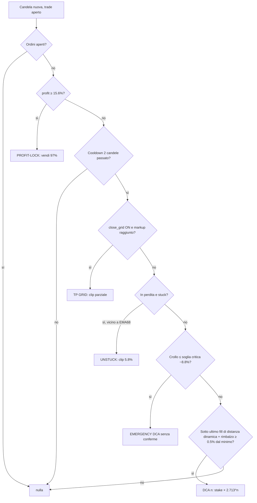

# RyLoS Classic — funzionamento completo della strategia

> Multi-oscillatore oversold long-only con DCA progressivo e meccaniche passivbot (trailing_grid_v7), configurazione di riferimento **5371** live su HYPE/USDT:USDT.
> Documento generato il 2026-07-24 dal sorgente `user_data/strategies/RyLoSStrategy.py` al tag `rylos-5371-baseline`.

## 01 · Identità e impianto

RyLoS Classic è una strategia **long-only** su timeframe **5 minuti**, pensata per un solo pair per volta (live: HYPE/USDT:USDT, futures Bybit, `max_open_trades = 1`). L'idea di fondo: comprare gli ipervenduti violenti di un asset volatile, mediare in discesa con una griglia DCA a conferma di rimbalzo, e uscire sul recupero con un trailing sul massimo. Le meccaniche di grid, trailing e unstuck sono un porting delle logiche di **passivbot** (template trailing_grid_v7, config dd39) dentro i callback di freqtrade.

- **Leva**: fissa 4x — serve solo a determinare il margine; il rischio reale è governato dal TWE (§04).
- **Ordini**: entry sempre **limit** (mai market sui buy), pricing lato `other`/top del book → fill tipicamente immediati senza pagare lo spread.
- **ROI**: `minimal_roi = {"0": 0.5}` — di fatto disattivato (scatterebbe a +50% sullo stake, cioè +12,5% di prezzo a leva 4); le uscite vere sono in `custom_exit` e `adjust_trade_position`.
- **Trailing stop nativo**: disabilitato, sostituito dal trailing close passivbot (§07).
- **Warmup**: 100 candele (per EMA68 e oscillatori).

## 02 · Indicatori

Tutto il calcolo vive in `populate_indicators`, quattro serie in croce — la strategia è volutamente povera di indicatori e ricca di logica di posizione:

| Serie | Definizione | Ruolo |
|---|---|---|
| `osc_4rsi` | media(RSI2, RSI7, RSI14) − 50 | Istogramma continuo centrato su 0: molto negativo = ipervenduto su tre orizzonti insieme. Guida entry e exit overbought. |
| `stoch_k` | %D fast dello STOCHF(14, 3) — cioè SMA(3) dello stocastico grezzo | Filtro di posizione nel range: conferma che il prezzo è nella parte bassa (entry) o alta (exit) del range recente. |
| `atr` | ATR(10) | Volatilità reattiva: allarga le distanze DCA quando il mercato si muove forte. |
| `ema_anchor` | EMA(68) sul close (~5,7 ore) | Ancoraggio passivbot: gate dell'entry iniziale e riferimento «vendi nella forza» dell'unstuck. |

## 03 · Entry iniziale

Il segnale (vettoriale, in `populate_entry_trend`) richiede **quattro condizioni contemporanee** sulla candela chiusa:

1. `osc_4rsi < −10.03` — ipervenduto composito;
2. `stoch_k < 36.2` — prezzo nella parte bassa del range a 14 periodi;
3. **candela rossa** (`close < open`) — si compra dentro la discesa, non sul rimbalzo già partito;
4. `close ≤ EMA68 × (1 − 0.011)` — ancoraggio passivbot `initial_ema_dist`: il prezzo deve stare almeno l'1,1% *sotto* la media, mai comprare a ridosso della media.

Il tag d'ingresso registra il valore dell'oscillatore: `buy_4rsi_-32` significa entry con istogramma a −32. Più il numero è profondo, più l'ipervenduto era violento.

## 04 · Sizing e gestione del rischio

Il rischio è governato dal **Total Wallet Exposure limit** (TWE, concetto passivbot), completamente **disaccoppiato dalla leva**: la leva 4x determina solo quanto margine blocca l'exchange, il TWE determina quanto valore nozionale la strategia può accumulare.

```
limite globale   = balance_totale × TWE                (5371: × 2.929)
limite per pair  = limite globale / max_open_trades
primo ordine     = balance_totale × first_order_pct    (5371: × 0.066)
stake DCA n      = balance_totale × first_order_pct × dca_multiplier^n
```

Con i valori 5371 (first order 6,6%, moltiplicatore 2,713) la serie degli stake vale ~6,6% → 17,9% → 48,6% del balance: `calculate_max_orders` simula la serie e si ferma quando il nozionale cumulato (stake × 4) sfonderebbe il limite per pair — il numero massimo di DCA è quindi **derivato**, non un parametro. Ogni ordine viene comunque ritagliato sul rimanente dei limiti (per pair e globale, con guardia al 95%) invece di essere rifiutato in blocco.

> **Perché conta** — Il confronto sperimentale 5371-vs-9529 ha mostrato che «chi media prima vince»: la potenza della strategia sta nella progressione geometrica degli stake, che abbassa la media velocemente. Il TWE è il guinzaglio che impedisce alla progressione di diventare esiziale.

## 05 · DCA progressivo

Il cuore della strategia vive in `adjust_trade_position`. Un DCA normale scatta solo se passano **tutti** questi cancelli, in ordine:

1. **Nessun ordine aperto** sul trade e **cooldown** di 2 candele (10 min) dall'ultimo fill;
2. prezzo **sotto l'ultimo fill** (si media solo in discesa);
3. la discesa dal fill al **minimo di finestra** supera la **distanza dinamica**;
4. conferma di **rimbalzo dal minimo ≥ 0,5%** (trailing entry passivbot: si compra sul rimbalzo confermato, mai al volo mentre scende).

### Distanza dinamica

```
distanza = dca_distance × (1 + ATR% × atr_mult) × (1 + exposure_ratio × we_weight)
  5371:      0.010     ×  (1 + ATR% × 1.689)   ×  (1 + expo × 0.242)
```

Due amplificatori sulla distanza base dell'1%: la **volatilità** (mercato nervoso → griglia più larga) e l'**esposizione** (posizione già carica → i DCA successivi pretendono discese maggiori). È il `grid_spacing` con volatility/we-weight di passivbot.

## 06 · Emergency DCA

Se il prezzo crolla oltre la soglia di emergenza **rispetto all'ultimo fill** (5371: −6,7%), il DCA cambia regime: alla soglia *critica* (−6,7% × 1.31 ≈ −8,8%) l'ordine parte **saltando** distanza dinamica e conferma di rimbalzo — è l'ultima mediazione prima che la posizione diventi irrecuperabile, con lo stake della serie geometrica ridotto quanto serve per stare nei limiti TWE. Tag: `emergency_dca_9.1%`.

## 07 · Le uscite

Cinque meccanismi, dal più prioritario. Nel 5371 il close-grid è **spento**: il profilo è «tieni tutto e vendi il pump».

### 1 · Profit-lock (`profit_lock_16.2%`)

Primo controllo in assoluto, **bypassa il cooldown**: se il profit del trade (sullo stake, a leva) supera il 15,6%, vende il **97%** della posizione. Serve a realizzare gli spike verticali di equity prima che ritraccino — sul pump il prezzo fa +4% in tre candele e il trailing da solo restituirebbe troppo. Il moncherino residuo (3%) esce con gli altri meccanismi.

### 2 · Close grid (`tp_grid_0.31%`) — OFF nel 5371

Take-profit a clip parziali quando il prezzo supera `avg_entry × (1 + markup)`; dopo 2 clip la successiva chiude tutto. Su HYPE l'optimizer lo ha sempre spento (meglio il pump pieno); sul candidato XMR ep 5123 è invece **acceso** con markup 0,2% — asset senza pump verticali preferiscono scalare a scaglioni.

### 3 · Trailing close (`sell_trailing_close_2.9%`) — l'uscita tipica (~98% dei trade)

```
armato : max_dal_ultimo_fill ≥ avg_price × (1 + 0.013)
scatta : prezzo ≤ max × (1 − 0.004)          → chiude tutto, solo in profitto
```

Il massimo si misura **dall'ultimo fill** (ogni DCA resetta la finestra). In pratica: il prezzo deve risalire l'1,3% sopra la media, poi il primo respiro dello 0,4% dal picco chiude la posizione. Non esiste uscita a breakeven: o il recupero arriva, o lavorano DCA/unstuck.

### 4 · 4RSI overbought (`sell_4rsi_31_5.2%`)

Specchio dell'entry: con profit > 4,1%, se `osc_4rsi > 24.8`, `stoch_k > 73.1` e candela **verde**, vende tutto dentro il pump in ipercomprato — cattura l'apice quando il trailing non si è ancora armato o il picco è esteso.

### 5 · Guard-stoploss

Stop a **−72,1% sullo stake** (a leva 4 ≈ −18% di prezzo sotto la media): non è un'uscita operativa ma una rete che taglia i death-spiral sopra il prezzo di liquidazione. Lo spazio hyperopt custom lo confina in banda −0.9…−0.4; i trade che recuperano non lo toccano mai.

## 08 · Unstuck e reti di sicurezza

Per le posizioni incagliate in perdita, il porting dell'unstuck passivbot riduce la posizione **a fettine, nella forza**:

- **Quando è "stuck"**: esposizione della pair ≥ 68,1% del suo limite TWE, *oppure* — anti-bag — posizione tenuta oltre **16 giorni** a prescindere dall'esposizione.
- **Dove vende**: solo se il prezzo è risalito fin quasi all'EMA68 (accetta fino allo 0,5% sotto) — mai vendere sul minimo.
- **Quanto**: clip del 5,8% dello stake, con **budget di perdita** per clip ≤ 0,7% del balance e cooldown di 1 ora tra le clip. Tag: `unstuck_17.2d_-8.4%`.

L'effetto è liberare esposizione gradualmente e pagare la perdita a rate piccole, invece di capitolare in un colpo solo.

## 09 · Flusso decisionale

Ordine di valutazione di `adjust_trade_position`, chiamato a ogni candela per il trade aperto:



In parallelo `custom_exit` valuta a ogni tick: prima il trailing close, poi il 4RSI overbought.

## 10 · Parametri della configurazione 5371

Spazio **buy** (entry, sizing, DCA):

| Parametro | Valore | Significato |
|---|---:|---|
| `osc_entry_threshold` | −10.028 | Soglia oversold del 4RSI |
| `entry_stoch_os` | 36.222 | Soglia oversold dello stocastico |
| `initial_ema_dist` | −0.011 | Entry solo ≥1,1% sotto EMA68 |
| `ema_span_candles` | 68 | Span EMA di ancoraggio (fisso) |
| `total_wallet_exposure_limit` | 2.929 | TWE: nozionale max = 2,93× il balance |
| `first_order_pct` | 0.066 | Primo ordine: 6,6% del balance |
| `dca_multiplier` | 2.713 | Progressione geometrica degli stake |
| `dca_distance` | 0.010 | Distanza DCA base 1% |
| `dca_atr_multiplier` | 1.689 | Peso volatilità sulla distanza |
| `dca_we_weight` | 0.242 | Peso esposizione sulla distanza |
| `dca_trailing_retracement_pct` | 0.005 | Conferma rimbalzo 0,5% dal minimo |
| `dca_cooldown_candles` | 2 | Attesa min tra ordini (10 min) |
| `emergency_dca_threshold` | −0.067 | Soglia emergenza dall'ultimo fill |
| `emergency_critical_multiplier` | 1.31 | Soglia critica = −6,7% × 1,31 ≈ −8,8% |

Spazio **sell** (uscite) e stoploss:

| Parametro | Valore | Significato |
|---|---:|---|
| `close_trailing_threshold_pct` | 0.013 | Armamento trailing: max ≥ media +1,3% |
| `close_trailing_retracement_pct` | 0.004 | Scatto: ritraccio 0,4% dal picco |
| `osc_exit_threshold` | 24.845 | Soglia overbought del 4RSI |
| `exit_stoch_ob` | 73.05 | Soglia overbought dello stocastico |
| `min_profit_for_overbought_exit` | 0.041 | Profit min per l'exit 4RSI (4,1% a leva) |
| `profit_lock_enabled` | True | Profit-lock attivo |
| `profit_lock_threshold` | 0.156 | Trigger: +15,6% sullo stake |
| `profit_lock_qty_pct` | 0.97 | Vende il 97% della posizione |
| `close_grid_enabled` | False | Clip grid spente su HYPE |
| `unstuck_threshold` | 0.681 | Stuck se esposizione ≥68% del limite pair |
| `unstuck_max_held_days` | 16 | Stuck comunque dopo 16 giorni |
| `unstuck_close_pct` | 0.058 | Clip del 5,8% dello stake |
| `unstuck_ema_dist` | −0.005 | Vende da 0,5% sotto EMA68 in su |
| `unstuck_loss_allowance_pct` | 0.007 | Perdita max 0,7% del balance per clip |
| `stoploss` | −0.721 | Guard-stop: −72,1% stake ≈ −18% prezzo |

## 11 · Note di implementazione

- **Cache incrementale degli estremi** (`_window_extremes`): massimo/minimo dall'ultimo fill calcolati O(1) ammortizzato per candela — i valori dipendono solo dalle candele, quindi la cache resta valida tra epoch hyperopt. Gestisce anche il mismatch di precisione datetime ms/µs del live.
- **Cache dei fill** (`_entry_fill_info`): la scansione degli ordini si rifà solo quando il numero di ordini cambia. **`_max_orders_cache`**: il conteggio ordini dipende solo dai rapporti tra parametri, una volta per epoch.
- **`disable_trade_deepcopy = True`**: patch del fork che salta il deepcopy del Trade nello strategy_safe_wrapper (~40% del tempo di backtest) — lecito perché i callback leggono soltanto.
- **Spazio stoploss custom** (`HyperOpt.stoploss_space`): banda −0.9…−0.4, attiva solo con `--spaces … stoploss`.
- **Seeding hyperopt** (patch del fork): l'epoch 1 di ogni run è sempre *enqueued* con i default della strategia — su HYPE full-range vale loss −43.068 / 828 trade, il metro con cui ogni run viene validato.
- **Deploy**: i parametri live viaggiano nel file `RyLoSStrategy.json` accanto al .py, che li sovrascrive al lancio (meccanismo nativo freqtrade). Su amazon quel json È la config 5371 e non va mai rimosso; su debian invece va cancellato prima di ogni hyperopt (json fantasma).

## 12 · Numeri di riferimento (candidato 5371)

| Metrica | Valore | Contesto |
|---|---:|---|
| Backtest full-range HYPE | +26.457,15% | 2.645.715 USDT su 10.000 iniziali, compounding |
| Trade | 828 | 811 win / 17 loss → 97,9% |
| Max drawdown (account) | 11,94% | Vincolo primario dell'euristica di selezione |
| Max underwater (balance) | 19,15% | |
| Sortino (daily wallet) | 3,32 | Loss function del run: SortinoRyLoS |
| Durata media trade | 10 h 49 m | |
| Live | dal 22-07-2026 | amazon, tmux `ft`, Bybit reale |

Robustezza: tre run hyperopt indipendenti da 10.000 epoch (spazio originale, spazio allargato, spazio allargato + gate ETRP) non hanno mai battuto il seed 5371 su HYPE. Nessun overlay di regime provato (ER exit, KAMA anchor, gate/DCA/exit ETRP) ha migliorato il quadro: la forza del sistema sta nella meccanica DCA/trailing, non nei filtri direzionali.
